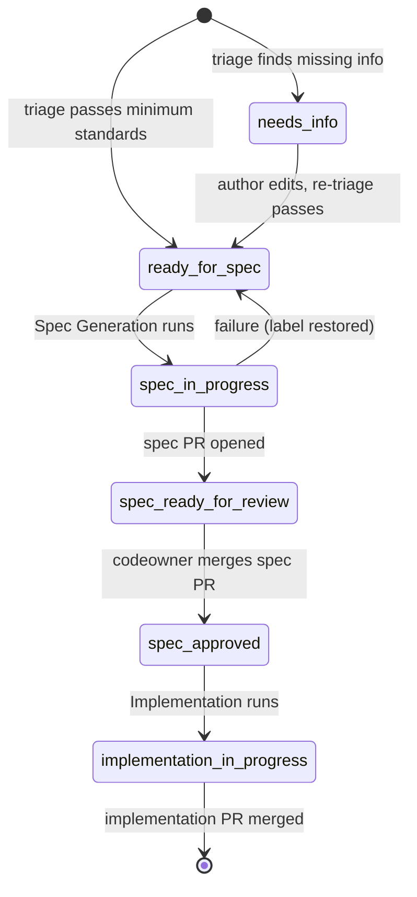

# Spec: Oz-powered issue → spec → implementation workflow
**Issue:** #206
**Status:** Draft — pending CODEOWNERS review
**Owners:** @zachreborn @Jakeasaurus
**Type:** CI/automation (no Terraform module changes)

## 1. Background
Today, issues filed via `terraform-bug.md` and `terraform-feature-request.md`
go straight to implementation. There is no enforced minimum-information bar
and no written spec reviewed by codeowners prior to code being written. The
goal of this work is to insert two automated, agent-driven steps (triage and
spec authoring) between issue creation and implementation, while keeping
human codeowners as the gate on the spec itself.

## 2. Non-goals
- Replacing codeowner review with agent approval.
- Automating any release/tagging behavior (handled by `release.yml`).
- Modifying existing Terraform modules under `modules/`.
- Bypassing existing CI (`build.yml`, `test.yml`, `scan.yml`) — implementation
  PRs go through the same gates as today.

## 3. Affected module path(s)
None. This change is scoped to `.github/`:
- New: `.github/workflows/issue-triage.yml`
- New: `.github/workflows/spec-generation.yml`
- New: `.github/workflows/spec-approved.yml`
- New: `.github/workflows/implementation.yml`
- New: `.github/specs/` (directory) with `README.md` and `_template.md`
- Modified: `.github/CODEOWNERS`
- Modified: `AGENTS.md`

## 4. Proposed design
This spec describes workflow automation rather than a Terraform module, so
the §4 Terraform-shape sections are not applicable. The architecture is:

### Pipeline state machine
Labels on the originating issue drive state. Trusted authors
(`author_association` in `{OWNER, MEMBER, COLLABORATOR}`) enter the
pipeline automatically on issue open; issues from less-trusted authors do
not auto-advance through Oz-agent stages.

### Workflows
All Oz-agent steps pin `warpdotdev/oz-agent-action` to a specific commit
SHA (`ce1621a` at time of authoring, with the `# main` comment indicating
the SHA tracks `main`) per the supply-chain policy enforced by zizmor.

- **`issue-triage.yml`** — Trigger: `issues: [opened, edited, labeled]` with
  guards to avoid loops, respect `skip-oz`, and require
  `author_association ∈ {OWNER, MEMBER, COLLABORATOR}`. Runs the pinned Oz
  action with a prompt that embeds the minimum-standards checklist and
  instructs the agent to comment + (re)label via `gh`.
- **`spec-generation.yml`** — Trigger: `issues: [labeled]` filtered to
  `ready-for-spec`, plus `workflow_dispatch`. Flips the issue to
  `spec-in-progress`, runs Oz to author a spec under `.github/specs/`, open a
  branch + PR, and apply `spec-ready-for-review`. Trust gate and `skip-oz`
  are enforced for both label and dispatch triggers (dispatch checks the
  target issue at runtime via `gh issue view`).
- **`spec-approved.yml`** — Trigger: `pull_request: [closed]` on
  `.github/specs/**`. Uses `actions/github-script@v7` (no agent) to parse the
  filename and/or `**Issue:** #<N>` header, then apply `spec-approved` to the
  originating issue and remove transitional labels. This workflow does NOT
  consume `WARP_API_KEY` and will act on merged spec PRs regardless of
  Oz-secret configuration.
- **`implementation.yml`** — Trigger: `issues: [labeled]` filtered to
  `spec-approved`, plus `workflow_dispatch`. Reads the spec from `main`,
  runs Oz to implement strictly per spec, opens an implementation PR with
  `Fixes #<N>` so the issue closes on merge. Same trust gate as
  spec-generation.

### Repo configuration (manual, one-time)
- Secret: `WARP_API_KEY`
- Variable (optional): `WARP_AGENT_PROFILE`
- Labels: `needs-info`, `ready-for-spec`, `spec-in-progress`,
  `spec-ready-for-review`, `spec-approved`, `implementation-in-progress`,
  `skip-oz`

## 5. Breaking-change assessment
- Breaking: **no**.
- Existing workflows (`build.yml`, `test.yml`, `scan.yml`, `release.yml`)
  are not modified.
- Existing issue templates continue to work; the new pipeline is additive.
- Until `WARP_API_KEY` is configured, the three Oz-agent workflows
  (`issue-triage.yml`, `spec-generation.yml`, `implementation.yml`) fail
  fast in their `Guard - require WARP_API_KEY` step and do not change any
  issue or PR state. `spec-approved.yml` does NOT use `WARP_API_KEY` (it is
  a plain `actions/github-script` job) and will act on any merged spec PR
  as soon as it lands.

## 6. Checkov / tfsec considerations
- New suppressions: **none** — no Terraform changes in this PR.
- Existing suppressions affected: **none**.

## 7. terraform-docs impact
**None.** No module-level changes; `<!-- BEGIN_TF_DOCS -->` blocks are
unaffected.

## 8. Testing
- `terraform fmt -check -diff -recursive` — must remain clean (no `.tf` changes).
- `super-linter` (existing `test.yml`) — must pass for the new YAML and Markdown.
- Manual dry-run after merge:
  1. Configure `WARP_API_KEY`.
  2. Create the seven labels (script provided in PR description).
  3. File a throwaway issue, verify triage comment + label.
  4. Edit the issue to satisfy minimum standards, verify `ready-for-spec`.
  5. Verify a spec PR is opened; merge it.
  6. Verify `spec-approved` is applied automatically.
  7. Verify an implementation PR opens and closes the issue on merge.

## 9. Open questions
- Pin `warpdotdev/oz-agent-action` to a SHA once a tagged release is
  available (skill currently documents `@main`).
- Add a `oz schedule` job to nag `needs-info` issues older than 7 days?
  Out of scope for this PR.
- Should the spec PR be created as a draft by default? Current decision:
  no — codeowners can convert to draft if they want more iteration.

## 10. Acceptance criteria
Mirrors the issue's "Confirmation" section:
- All four workflow files exist and pass `super-linter`.
- `.github/specs/` exists with `README.md` and `_template.md`.
- `.github/CODEOWNERS` has an explicit entry for `/.github/specs/`.
- `AGENTS.md` has a section documenting the pipeline.
- Dry-run end-to-end test produces: triage comment → spec PR →
  `spec-approved` → implementation PR.
