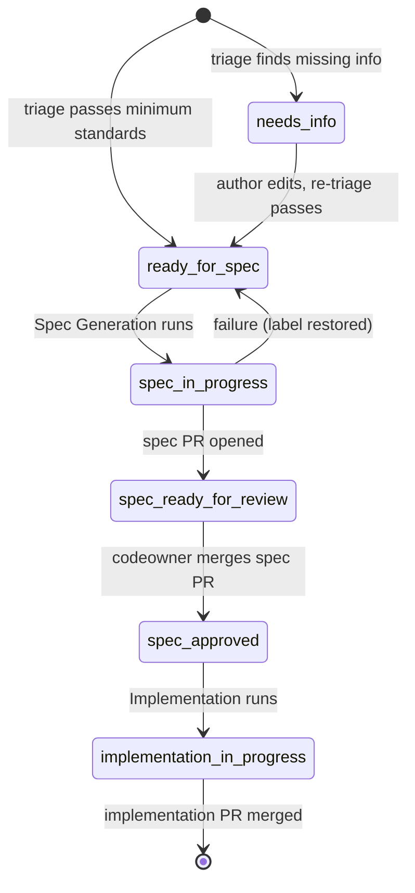

# AGENTS.md

This file provides guidance to WARP (warp.dev) when working with code in this repository.

## Overview

This is an **OpenTofu/Terraform modules library** providing reusable infrastructure-as-code modules primarily for AWS, with additional support for AzureAD, Cloudflare, vSphere, Scalr, and Terraform Cloud/Enterprise. **OpenTofu is the default and recommended tool**; Terraform is also fully supported. Modules are consumed by callers (including the `global/` directory) via standard `module {}` blocks, which are identical in syntax for both tools.

## Provider Documentation Sources
When creating or updating any module, **always consult the official provider documentation** to ensure complete attribute coverage, correct argument types, and up-to-date defaults. The canonical sources are listed below.

For each provider, prefer the GitHub source repository (most authoritative schema — check the resource Go file under `internal/service/<service>/`) and cross-reference with the registry docs for human-readable descriptions and examples.

| Provider | GitHub Source | Registry Docs |
|---|---|---|
| AWS — OpenTofu (preferred tool) | https://github.com/opentofu/terraform-provider-aws | https://registry.terraform.io/providers/hashicorp/aws/latest/docs |
| AWS — HashiCorp (`source = "hashicorp/aws"`) | https://github.com/hashicorp/terraform-provider-aws | https://registry.terraform.io/providers/hashicorp/aws/latest/docs |
| AzureAD | https://github.com/hashicorp/terraform-provider-azuread | https://registry.terraform.io/providers/hashicorp/azuread/latest/docs |
| Cloudflare | https://github.com/cloudflare/terraform-provider-cloudflare | https://registry.terraform.io/providers/cloudflare/cloudflare/latest/docs |
| vSphere | https://github.com/hashicorp/terraform-provider-vsphere | https://registry.terraform.io/providers/hashicorp/vsphere/latest/docs |
| TFE (Terraform Cloud/Enterprise) | https://github.com/hashicorp/terraform-provider-tfe | https://registry.terraform.io/providers/hashicorp/tfe/latest/docs |
| Scalr (`source = "registry.scalr.io/scalr/scalr"`) | https://github.com/Scalr/terraform-provider-scalr | https://docs.scalr.io/terraform-provider |

**Why this matters**: provider schemas evolve with each release. A module written without consulting current docs may silently omit newly added arguments, use deprecated attribute names, or set defaults that conflict with provider-enforced constraints. Checking the source before writing variables ensures the module stays in sync with `aws >= 6.0.0` (and equivalent versions for other providers).

## Key Commands

### Local pre-commit hooks (recommended)

A `.pre-commit-config.yaml` at the repo root runs the same `tofu fmt` and `terraform-docs` steps that CI verifies. CI does **not** auto-fix anything — install the hooks once and your commits will stay green:

```sh
brew install pre-commit terraform-docs
pre-commit install            # install the git hook
pre-commit run --all-files    # run against the whole repo on demand
```

If you prefer not to use pre-commit, run the formatting and docs commands below by hand before pushing.

### Formatting

All code must be formatted with OpenTofu (the default):
```sh
tofu fmt -recursive
```

Terraform produces identical formatting and may be used as an alternative:
```sh
terraform fmt -recursive
```

To check formatting without making changes (as CI does):
```sh
tofu fmt -check -diff -recursive
```

### Documentation Generation

Each module's README.md has a `<!-- BEGIN_TF_DOCS -->` / `<!-- END_TF_DOCS -->` block that is auto-generated by `terraform-docs`. To regenerate docs for a specific module:
```sh
terraform-docs markdown table --output-file README.md --output-mode inject <module_path>
```

To regenerate docs for every module at once, run `pre-commit run --all-files` (the `terraform_docs` hook walks each module directory and applies the shared `modules/.terraform-docs.yml` config — matching what CI verifies). Avoid `terraform-docs --recursive modules`: it generates a single empty README at the top level rather than recursing into per-module subdirectories.

The `Verify - terraform-docs` job runs on every PR and on every push to `main`, regenerating docs in CI and failing the build if the result differs from what was committed. CI **does not** push fixes back to your branch — regenerate docs locally (via `pre-commit run --all-files` or per-module via the command above) and commit the result yourself.

### Security Scanning

Checkov scans run on a schedule and can be triggered manually. To run locally:
```sh
checkov -d <module_path>
```

The `.checkov.yaml` at the repo root configures intentionally suppressed checks — do not remove existing suppressions without understanding their rationale (see comments in that file).

### Validation (per module)

To validate a module locally, initialize and validate it from its directory (OpenTofu default):
```sh
tofu -chdir=<module_path> init -backend=false
tofu -chdir=<module_path> validate
```

Terraform equivalents (also supported):
```sh
terraform -chdir=<module_path> init -backend=false
terraform -chdir=<module_path> validate
```

## Repository Structure

```
modules/          # Reusable Terraform modules (organized by provider)
  aws/            # 50+ AWS service modules (vpc, ec2_instance, iam, rds, etc.)
  azuread/        # Azure AD modules (conditional_access, group)
  cloudflare/     # Cloudflare modules (record, zone)
  vsphere/        # vSphere modules
  terraform/      # Terraform Cloud/Enterprise modules (workspace, team, etc.)
  scalr/          # Scalr modules
  services/       # Higher-level composed services (aws_backup, siem)
  bootstrapping/  # Account/org bootstrapping configurations
  module_template/ # Canonical template for new modules
global/           # Live infrastructure configurations that consume modules
  iam/            # IAM roles and policies
```

## Module Structure

Every module follows the same four-file layout (use `modules/module_template/` as the starting point for new modules):

- `main.tf` — Provider `terraform {}` block, data sources, locals, and resources
- `variables.tf` — Input variable declarations
- `outputs.tf` — Output value declarations
- `README.md` — Usage examples + auto-generated `terraform-docs` block

## Module Design Specifications

All modules must adhere to the following design principles. These apply equally to new modules and to updates of existing ones.

### 1. Complete Resource Coverage

Each module must expose **all attributes and configuration options** available for the underlying provider resource(s). No attribute that is supported by the provider resource should be silently omitted from the module's `variables.tf`. Attributes that have a safe, opinionated default may use `default = <value>` rather than requiring the caller to supply them, but the variable must still exist so callers can override it.

**Before writing any variable or resource block, look up the resource in the official provider documentation** (see [Provider Documentation Sources](#provider-documentation-sources)). Use the GitHub source as the definitive schema and the registry docs for descriptions and valid values.

- Every provider resource argument must map to a corresponding input variable.
- Every provider resource attribute worth surfacing must appear in `outputs.tf`.
- Optional or advanced attributes should use `default = null` when no sensible default exists, which causes the provider to use its own default.

### 2. Module Composition — No Inline Cross-Cutting Resources

Modules that require resources from another domain **must call the appropriate child module** rather than declaring those resources inline. For example:

- An S3 bucket module that needs a KMS key must call the `modules/aws/kms` module.
- An S3 bucket module that needs access logging must call the `modules/aws/s3/bucket` module (as a separate logging bucket instance).
- An EC2 module that needs an IAM instance profile must call the `modules/aws/iam/role` module.
- A service that needs CloudWatch alarms must call the `modules/aws/cloudwatch/alarm` module.

This keeps each module focused on a single resource type, avoids duplicated logic, and ensures cross-cutting concerns (IAM, KMS, CloudWatch, etc.) remain consistent across the library. Inline resource blocks for resources that belong to another module are **not permitted in new or significantly updated modules**. Existing modules that currently embed cross-cutting resources inline (e.g., the S3 bucket module's optional inline KMS key) are tracked for future refactoring to comply with this rule.

### 3. Secure and Well-Architected Defaults

All default values must reflect **AWS Well-Architected Framework** best practices and **CIS AWS Foundations Benchmark** recommendations. Specifically:

- Encryption at rest and in transit must be **enabled by default** wherever supported.
- Public access must be **disabled by default** (e.g., `block_public_acls = true` for S3, no `0.0.0.0/0` ingress rules by default).
- Logging and monitoring must be **enabled by default** where the resource supports it (e.g., S3 server access logging, VPC flow logs, CloudTrail).
- Deletion protection and termination protection should be **enabled by default** for stateful resources (RDS, OpenSearch, etc.).
- Versioning must default to **`Enabled`** for new S3 bucket modules; existing modules with a `Disabled` default should be updated in a future PR. MFA delete is recommended by CIS but requires out-of-band enablement (the AWS API requires MFA credentials during the call) and cannot be enforced as a Terraform default.
- IAM least-privilege: modules must not create overly broad policies; use specific actions and resources.

Callers may override any default, but the out-of-the-box configuration should be production-safe without additional tuning.

### 4. Documentation and Usage Examples

Every module `README.md` must include:

- A brief **description** of what the module does and which AWS/provider resource(s) it manages.
- A **prerequisites** section listing any modules or resources the caller must provision beforehand.
- At least one complete **usage example** as a `module {}` block showing all required variables and commonly used optional ones.
- A **notes / design decisions** section explaining any non-obvious defaults or behaviours.
- The `<!-- BEGIN_TF_DOCS --> … <!-- END_TF_DOCS -->` block, generated by `terraform-docs` and regenerated locally (via pre-commit or by hand); CI only verifies the committed output and does not auto-commit fixes.

Example block format:
```hcl
module "example_s3_bucket" {
  source = "github.com/zachreborn/terraform-modules//modules/aws/s3/bucket"

  bucket = "my-app-data"

  # Optional overrides
  versioning_status = "Enabled"
  sse_algorithm     = "aws:kms"

  tags = {
    Team       = "platform"
    CostCenter = "12345"
  }
}
```

### 5. Scalable Inputs via YAML / `for_each`

Modules that can logically manage multiple instances of a resource (e.g., multiple S3 buckets, multiple IAM roles, multiple security-group rules) **must support a map or YAML-based input** so callers can scale to hundreds or thousands of resources without duplicating module blocks.

Preferred patterns:

**Map of objects input** (in-line HCL):
```hcl
variable "buckets" {
  description = "Map of S3 bucket configurations keyed by logical name."
  type = map(object({
    versioning_status = optional(string, "Enabled")
    sse_algorithm     = optional(string, "aws:kms")
    lifecycle_rules   = optional(list(any), [])
  }))
  default = {}
}
```

**YAML file input** (for large-scale deployments):
```hcl
# caller's terraform
locals {
  buckets = yamldecode(file("${path.module}/buckets.yaml"))
}

module "s3" {
  source  = "github.com/zachreborn/terraform-modules//modules/aws/s3/bucket"
  buckets = local.buckets
}
```
```yaml
# buckets.yaml
application-data:
  versioning_status: "Enabled"
  sse_algorithm: "aws:kms"
audit-logs:
  versioning_status: "Suspended"
```

Modules that manage a single, standalone resource by design (e.g., a VPC — typically one per account/region) do not need map inputs but should be documented as such.

## Code Conventions

**Tool version requirements**: All modules require `opentofu >= 1.6.0` **or** `terraform >= 1.0.0` (the `required_version = ">= 1.0.0"` constraint in each module's `terraform {}` block satisfies both, since OpenTofu 1.6.x ≥ 1.0.0). For AWS modules, `aws >= 6.0.0` is also required.

**Dual-tool compatibility**: Modules must not use HCL features that are exclusive to one tool post-fork. All standard HCL constructs (`for_each`, `dynamic`, `locals`, `count`, `moved`, etc.) are identical between OpenTofu 1.6+ and Terraform 1.5+.

**Exception — `modules/terraform/`**: The `modules/terraform/` directory (workspace, organization, project, team, etc.) uses the `hashicorp/tfe` provider to manage Terraform Cloud/Enterprise resources. These modules are **Terraform-only** and are not compatible with OpenTofu.

**Section headers**: Group blocks with comment headers using the pattern:
```hcl
###########################
# Section Name
###########################
```

**Tagging**: Tags are always merged to include a `Name` key:
```hcl
tags = merge(tomap({ Name = var.name }), var.tags)
```

**Conditional resources**: Use `count = var.enable_x ? 1 : 0` for optional resources.

**Lifecycle ignores**: Resources like `aws_instance` intentionally ignore `ami` and `user_data` changes to prevent unintended replacements.

**tfsec suppressions**: When a resource intentionally violates a security check (e.g., because the behavior is controlled by caller variables), add an inline comment:
```hcl
#tfsec:ignore:aws-ec2-no-public-egress-sgr
```

## CI/CD Pipelines

| Workflow | Trigger | What it does |
|---|---|---|
| `build.yml` | PR or push → main | Regenerates `terraform-docs` in a sandbox and fails the build if the committed docs are out of date (read-only — no auto-commit) |
| `test.yml` | PR or push → main | Checks `tofu fmt` compliance + invisible-Unicode check + super-linter |
| `scan.yml` | Scheduled (12 hrs) or manual | Checkov security scan, uploads SARIF to GitHub |
| `release.yml` | Push of `v*.*.*` tag | Creates a GitHub release with auto-generated release notes |
| `issue-triage.yml` | Issue opened/edited/labeled | Oz agent validates issue against minimum standards, comments + labels |
| `spec-generation.yml` | Issue labeled `ready-for-spec` (or manual) | Oz agent opens a spec PR under `.github/specs/` |
| `spec-approved.yml` | Spec PR merged | Flips originating issue to `spec-approved` |
| `implementation.yml` | Issue labeled `spec-approved` (or manual) | Oz agent opens an implementation PR per the merged spec |

## Automated issue/spec/impl pipeline

This repo runs an Oz-powered pipeline that turns issues into reviewed specs and approved specs into implementation PRs. The full design lives in `.github/specs/issue-206-oz-issue-to-impl-workflow.md`.



**Stages and the label that drives each transition**:

1. Issue opened → triage agent runs (only for trusted authors; see below).
   - Missing required info → label `needs-info` + comment listing what's missing.
   - Complete → label `ready-for-spec` + classification comment.
2. `ready-for-spec` → spec-generation agent runs; opens a PR under `.github/specs/issue-<N>-<slug>.md`; issue moves to `spec-in-progress` then `spec-ready-for-review`.
3. Spec PR merged → `spec-approved.yml` flips the issue to `spec-approved`.
4. `spec-approved` → implementation agent runs; opens an implementation PR with `Fixes #<N>`; issue moves to `implementation-in-progress` and closes on PR merge.

**Running CI on Oz PRs**: Spec and implementation PRs are opened by `github-actions[bot]` using the built-in `GITHUB_TOKEN`. GitHub suppresses cascading workflow runs triggered by `GITHUB_TOKEN`, so as of GitHub's 2026-06-11 change ("Bot-created pull requests can run workflows if approved") these PRs create the required checks (`Linter`, `Test OpenTofu`, `Verify - terraform-docs`, `Invisible Unicode Check`) in an **approval-required** state instead of running them automatically. A maintainer with **write access** must click **Approve workflows to run** in the PR's merge-box banner (or the Actions tab) to start them. This approval is required **per PR**, also applies to any later push the agent makes to the PR branch, and cannot be performed by the agent itself. (Before this change the only option was to manually re-trigger CI, e.g. by closing and reopening the PR.)

**Trust gate**: the three Oz-agent workflows (`issue-triage.yml`, `spec-generation.yml`, `implementation.yml`) only run when the originating issue's `author_association` is one of `OWNER`, `MEMBER`, or `COLLABORATOR`. Issues from `CONTRIBUTOR`/`FIRST_TIME_CONTRIBUTOR`/`NONE` will not be auto-triaged and will not advance through the pipeline until a maintainer takes manual action. This is intentional: it keeps untrusted issue bodies out of the secret-backed agent prompts.

**Minimum standards** enforced by triage:

- **Bug**: affected module path, OpenTofu or Terraform version and relevant provider versions, repro steps, expected vs actual, one of {error, stack trace, plan/apply output}, acceptance criteria.
- **Feature**: target module path, motivation, proposed inputs/outputs (high level), breaking-change assessment, acceptance criteria.

**Overrides**:

- Apply the `skip-oz` label to any issue to disable all Oz workflows for it (label-triggered runs *and* `workflow_dispatch`).
- Use `workflow_dispatch` on `spec-generation.yml` or `implementation.yml` to re-run a stage manually with an `issue_number` input. Manual dispatch still re-checks `skip-oz` and the trust gate at runtime.

**Required repo config** (one-time): set `WARP_API_KEY` (secret), optional `WARP_AGENT_PROFILE` (variable), and create the labels listed above plus `needs-info` and `skip-oz`. The three Oz-agent workflows fail fast with a clear error if `WARP_API_KEY` is missing, so the PR is safe to merge before configuration is done. Note: `spec-approved.yml` does *not* use `WARP_API_KEY` (it is a plain `actions/github-script` job) and will act on merged spec PRs as soon as it lands, regardless of secret configuration.

**Specs directory**: see `.github/specs/README.md` for naming and `.github/specs/_template.md` for the canonical layout.

**Agent instructions live in skills**: the canonical instructions for each pipeline stage are versioned [skills](https://docs.warp.dev/agent-platform/cloud-agents/skills-as-agents) under `.warp/skills/`:

- `.warp/skills/issue-triage/` — triage/classification/labeling (used by `issue-triage.yml`)
- `.warp/skills/spec-generation/` — spec authoring + spec PR (used by `spec-generation.yml`)
- `.warp/skills/spec-implementation/` — implementation + impl PR (used by `implementation.yml`)

Each workflow references its skill via the `skill:` input of `warpdotdev/oz-agent-action` (e.g. `skill: zachreborn/terraform-modules:issue-triage`) and passes only the run-specific context each stage needs through `prompt:` — triage receives the issue number, repository, and the issue title/body/labels; spec-generation receives the issue number and repository; implementation also receives the resolved spec-file path. Edit the `SKILL.md` files to change agent behavior — do **not** re-embed instructions in the workflow YAML. Because the skills live in this repo, the same stages can also be launched from the Oz CLI, web app, or a schedule, e.g. `oz agent run-cloud --skill "zachreborn/terraform-modules:issue-triage" --prompt "Triage issue #NNN"`.

## Security Posture Philosophy

This is a **module library** — security enforcement is the caller's responsibility. Many Checkov checks are suppressed in `.checkov.yaml` because modules must accept any value for variables like CIDR ranges, ports, encryption settings, etc. When adding new suppressions, document the reason in the same format as existing entries.

## Creating a New Module

1. **Consult provider documentation first.** Before writing any code, look up the target resource in the provider's GitHub source and registry docs (see [Provider Documentation Sources](#provider-documentation-sources)). Note every argument, its type, constraints, and whether it is required or optional — this is your checklist for `variables.tf` and `outputs.tf`.
2. Copy `modules/module_template/` to the appropriate provider subdirectory.
3. Implement resources in `main.tf`, declare variables in `variables.tf`, and expose outputs in `outputs.tf`.
4. Update `README.md` — make sure the `<!-- BEGIN_TF_DOCS --> … <!-- END_TF_DOCS -->` markers exist; their contents will be regenerated by `terraform-docs` (run locally via pre-commit or by hand — CI verifies but does not auto-commit).
5. Run `pre-commit run --all-files` (or, manually, `tofu fmt -recursive` followed by `terraform-docs markdown table --output-file README.md --output-mode inject <module_path>` for the new module) before committing so the `Build` and `Test` jobs pass on the first push.
