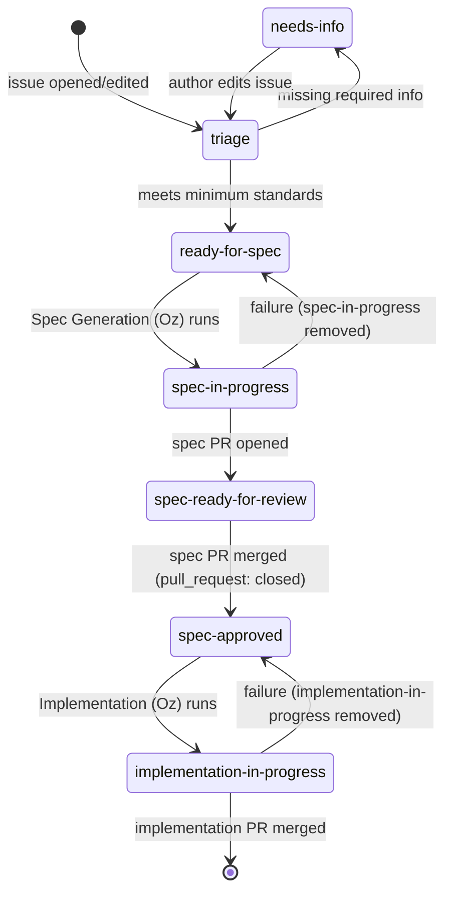

<!-- Improved compatibility of back to top link: See: https://github.com/othneildrew/Best-README-Template/pull/73 -->

<a name="readme-top"></a>

<!--
*** Thanks for checking out the Best-README-Template. If you have a suggestion
*** that would make this better, please fork the repo and create a pull request
*** or simply open an issue with the tag "enhancement".
*** Don't forget to give the project a star!
*** Thanks again! Now go create something AMAZING! :D
-->

<!-- PROJECT SHIELDS -->
<!--
*** I'm using markdown "reference style" links for readability.
*** Reference links are enclosed in brackets [ ] instead of parentheses ( ).
*** See the bottom of this document for the declaration of the reference variables
*** for contributors-url, forks-url, etc. This is an optional, concise syntax you may use.
*** https://www.markdownguide.org/basic-syntax/#reference-style-links
-->

[![Contributors][contributors-shield]][contributors-url]
[![Forks][forks-shield]][forks-url]
[![Stargazers][stars-shield]][stars-url]
[![Issues][issues-shield]][issues-url]
[![MIT License][license-shield]][license-url]
[![LinkedIn][linkedin-shield]][linkedin-url]

<!-- PROJECT LOGO -->
<br />
<div align="center">
  <a href="https://github.com/zachreborn/terraform-modules">
    
  </a>

<h3 align="center">terraform-modules</h3>
  <p align="center">
    OpenTofu (and Terraform) modules to deploy and manage cloud resources using the latest well-architected frameworks
    <br />
    <a href="https://github.com/zachreborn/terraform-modules"><strong>Explore the docs »</strong></a>
    <br />
    <br />
    <a href="https://zacharyhill.co/">Zachary Hill</a>
    ·
    <a href="https://github.com/zachreborn/terraform-modules/issues">Report Bug</a>
    ·
    <a href="https://github.com/zachreborn/terraform-modules/issues">Request Feature</a>
  </p>
</div>

<!-- TABLE OF CONTENTS -->
<details>
  <summary>Table of Contents</summary>
  <ol>
    <li>
      <a href="#about-the-project">About The Project</a>
      <ul>
        <li><a href="#built-with">Built With</a></li>
      </ul>
    </li>
    <li>
      <a href="#getting-started">Getting Started</a>
      <ul>
        <li><a href="#prerequisites">Prerequisites</a></li>
        <li><a href="#installation">Installation</a></li>
      </ul>
    </li>
    <li><a href="#usage">Usage</a></li>
    <li><a href="#module-design-specifications">Module Design Specifications</a></li>
    <li><a href="#roadmap">Roadmap</a></li>
    <li><a href="#contributing">Contributing</a></li>
    <li><a href="#license">License</a></li>
    <li><a href="#contact">Contact</a></li>
    <li><a href="#acknowledgments">Acknowledgments</a></li>
  </ol>
</details>

<!-- ABOUT THE PROJECT -->

## About The Project

[![Product Name Screen Shot][product-screenshot]](https://github.com/zachreborn/terraform-modules)

These terraform modules were originally created as part of a six month adoption of 'Infrastructure as Code' at Zachary Hill. They serve as the basis to an iterative approach to managing infrastructure. They've grown and expanded to be the workhorse of our organization that we wish to share and collaborate with the world. We are ever evolving and this code will continues to evolve as features, needs, and best practices do.

<p align="right">(<a href="#readme-top">back to top</a>)</p>

### Built With

- [![OpenTofu][OpenTofu.org]][OpenTofu-url] *(default)*
- [![Terraform][Terraform.io]][Terraform-url] *(also supported)*

<p align="right">(<a href="#readme-top">back to top</a>)</p>

<!-- GETTING STARTED -->

## Getting Started

To get a local copy up and running, simply clone this repo.

### Prerequisites

OpenTofu is the default and recommended tool. Terraform is also supported.

**OpenTofu (recommended):**
- macOS
  ```sh
  brew install opentofu
  ```
- Linux
  ```sh
  # See https://opentofu.org/docs/intro/install/ for all options
  snap install --classic opentofu
  ```
- Windows
  ```sh
  choco install opentofu
  ```

**Terraform (alternative):**
- macOS
  ```sh
  brew install terraform
  ```
- Debian/Ubuntu
  ```sh
  apt install terraform
  ```
- Windows
  ```sh
  choco install -y terraform
  ```

### Installation

1. Clone the repo
   ```sh
   git clone https://github.com/zachreborn/terraform-modules.git
   ```

<p align="right">(<a href="#readme-top">back to top</a>)</p>

<!-- USAGE EXAMPLES -->

## Usage

Navigate to the folder for the provider and subsequent module, service, or infrastructure you're looking to utilize. Within each module a README.md has documented the usage instructions and examples for that module. Included in each README.md is also an output of automated `terraform-docs` which has requirements, inputs, and outputs.

All modules support both **OpenTofu** (the default) and **Terraform**. Commands are interchangeable — substitute `tofu` for `terraform` (or vice versa) as appropriate for your toolchain.

### Examples:

- [CloudTrail](https://github.com/zachreborn/terraform-modules/tree/main/modules/aws/cloudtrail)
- [EC2](https://github.com/zachreborn/terraform-modules/tree/main/modules/aws/ec2_instance)
- [VPC](https://github.com/zachreborn/terraform-modules/tree/main/modules/aws/vpc)

_For more examples, please refer to the [Documentation](https://github.com/zachreborn/terraform-modules)_

<p align="right">(<a href="#readme-top">back to top</a>)</p>

<!-- MODULE DESIGN -->

## Module Design Specifications

All modules in this library are built to a consistent set of design principles. Contributors and the automated Oz pipeline are expected to follow these when creating or updating any module.

### Complete Resource Coverage

Every module exposes **all attributes and configuration options** of the underlying provider resource(s). No supported provider argument is silently omitted — each maps to a corresponding input variable in `variables.tf`. Attributes with a safe, opinionated default use `default = <value>`; attributes with no sensible default use `default = null` so the provider applies its own default. Meaningful resource attributes are surfaced in `outputs.tf`.

### Module Composition

Modules that depend on resources from a different domain **must call the appropriate sibling module** rather than declaring those resources inline. Cross-cutting concerns — KMS keys, IAM roles/policies, CloudWatch log groups/alarms, S3 logging buckets — each belong to their own module. This avoids logic duplication and keeps every module focused on a single resource type.

Inline resource blocks for resources that belong to another module are **not permitted in new or significantly updated modules**. Existing modules that currently embed cross-cutting resources inline (e.g., the S3 bucket module's optional inline KMS key) are tracked for future refactoring.

Examples of the composition pattern:

| Module | Instead of inline… | Calls… |
|---|---|---|
| `aws/s3/bucket` (with server-side encryption) | `aws_kms_key` | `modules/aws/kms` |
| `aws/s3/bucket` (with access logging) | `aws_s3_bucket` (log bucket) | `modules/aws/s3/bucket` (separate log bucket instance) |
| `aws/ec2_instance` (with instance profile) | `aws_iam_role` / `aws_iam_instance_profile` | `modules/aws/iam/role` |
| `aws/rds` (with metric alarms) | `aws_cloudwatch_metric_alarm` | `modules/aws/cloudwatch/alarm` |

### Secure and Well-Architected Defaults

Out-of-the-box defaults reflect the **AWS Well-Architected Framework** and **CIS AWS Foundations Benchmark**:

- **Encryption** — at rest and in transit enabled by default wherever supported.
- **Public access** — disabled by default (e.g., S3 `block_public_acls = true`; no `0.0.0.0/0` default ingress rules).
- **Logging & monitoring** — enabled by default where the resource supports it (S3 server access logging, VPC flow logs, CloudTrail, etc.).
- **Deletion & termination protection** — enabled by default for stateful resources (RDS, OpenSearch, etc.).
- **S3 versioning** — new modules must set `versioning_status = "Enabled"` as the default; existing modules with a `Disabled` default will be updated. MFA delete is recommended by CIS but requires out-of-band enablement and cannot be enforced as a Terraform default.
- **IAM least privilege** — policies use specific actions and resource ARNs; no wildcard `*` actions in defaults.

Callers may override any default. The goal is that the zero-config deployment is production-safe.

### Documentation and Usage Examples

Every module `README.md` must include:

1. A brief **description** of what the module manages.
2. A **prerequisites** section listing upstream modules or resources the caller must provide.
3. At least one complete **usage example** as a `module {}` block.
4. A **notes / design decisions** section for non-obvious defaults or behaviours.
5. The auto-generated `<!-- BEGIN_TF_DOCS --> … <!-- END_TF_DOCS -->` block.

### Scalable Inputs

Modules that can manage multiple instances of a resource support a **map-of-objects** (or YAML-decoded equivalent) input so a single module block can scale to any number of resources:

```hcl
# Target pattern: a module built to this spec exposes a map-of-objects input.
# Existing singleton modules (like iam/role) are being updated to this interface.
module "iam_roles" {
  source = "github.com/zachreborn/terraform-modules//modules/aws/iam/role"

  roles = {
    "app-server" = {
      description          = "EC2 app server role"
      assume_role_services = ["ec2.amazonaws.com"]
    }
    "lambda-processor" = {
      description          = "Lambda execution role"
      assume_role_services = ["lambda.amazonaws.com"]
    }
  }
}
```

```hcl
# YAML-backed input for large deployments
locals {
  roles = yamldecode(file("${path.module}/roles.yaml"))
}

module "iam_roles" {
  source = "github.com/zachreborn/terraform-modules//modules/aws/iam/role"
  roles  = local.roles
}
```

Modules that are inherently singleton (e.g., a VPC, an AWS Organization) are exempt and should document that explicitly.

### Native Test Coverage

Every new or significantly updated module **must ship a `tests/` directory** of native OpenTofu tests (`*.tftest.hcl`, run via `tofu test`) covering a valid baseline, every variable validation rule, every conditional resource branch, meaningful outputs, and (for wrapper modules) submodule wiring. Tests run offline via `mock_provider`/`mock_resource` — no real credentials required. `modules/module_template/tests/` ships the scaffolding to start from.

Tests must never be weakened to force a pass — a failing test means the module code (or, rarely, the test itself) has a bug that needs fixing, not an assertion to loosen.

For the full specification including examples and enforcement rules, see [`AGENTS.md § Module Design Specifications`](./AGENTS.md#module-design-specifications).

<p align="right">(<a href="#readme-top">back to top</a>)</p>

<!-- ROADMAP -->

## Roadmap

See the [open issues](https://github.com/zachreborn/terraform-modules/issues) for a full list of proposed features (and known issues).

<p align="right">(<a href="#readme-top">back to top</a>)</p>

<!-- CONTRIBUTING -->

## Contributing

Contributions are what make the open source community such an amazing place to learn, inspire, and create. Any contributions you make are **greatly appreciated**.

This project uses an **Oz-powered agentic development pipeline** that turns well-formed issues into reviewed specs, and approved specs into implementation PRs. You can contribute either by filing an issue and letting the pipeline drive the work, or by opening a PR yourself. Both paths go through the same CI and codeowner review.

The authoritative reference for repo conventions, the pipeline design, labels, and trust gating is [`AGENTS.md`](./AGENTS.md). The sections below summarize what you need to know to participate.

### Pipeline overview

The diagram below shows the end-to-end flow from issue creation to a merged implementation PR. Every hyphenated state in the diagram (`needs-info`, `ready-for-spec`, `spec-in-progress`, `spec-ready-for-review`, `spec-approved`, `implementation-in-progress`) corresponds to a GitHub label of the same name on the originating issue. The `triage` node is **not** a label — it represents an active run of the `Issue Triage (Oz)` workflow. Transitions are triggered by a mix of GitHub events (an issue being opened/edited, or the spec PR being merged) and labels that the Oz workflows apply and react to.



The four Oz workflows that drive these transitions are:

- [`issue-triage.yml`](./.github/workflows/issue-triage.yml) — validates new and edited issues against the minimum standards, then applies `needs-info` or `ready-for-spec`.
- [`spec-generation.yml`](./.github/workflows/spec-generation.yml) — opens a spec PR under `.github/specs/issue-<N>-<slug>.md` based on `_template.md`.
- [`spec-approved.yml`](./.github/workflows/spec-approved.yml) — when a spec PR is merged, flips the originating issue to `spec-approved` and dispatches the next stage.
- [`implementation.yml`](./.github/workflows/implementation.yml) — reads the merged spec from `main` and opens an implementation PR with `Fixes #<N>`.

All three Oz-agent workflows (`issue-triage`, `spec-generation`, `implementation`) gate on the issue author's `author_association` being one of `OWNER`, `MEMBER`, or `COLLABORATOR`. Issues from external contributors are not auto-advanced through the pipeline; a maintainer must shepherd them manually. Apply the `skip-oz` label at any time and each Oz agent will abort at the start of its run. Note that `spec-approved.yml` itself does **not** check `skip-oz`, so merging a spec PR will still dispatch `implementation.yml`; the dispatched run then aborts during its eligibility step, producing a (harmless but visible) failed workflow run in the Actions tab.

### Filing an issue

Use the issue templates under [`.github/ISSUE_TEMPLATE/`](./.github/ISSUE_TEMPLATE) and include everything the triage agent looks for. Issues that meet the minimum standards are auto-labeled `ready-for-spec` and the pipeline takes over from there.

**Bug** issues must include:

1. Affected module path (e.g. `modules/aws/ec2_instance`).
2. OpenTofu or Terraform version and relevant provider versions.
3. Reproduction steps.
4. Expected vs. actual behavior.
5. One of: error message, stack trace, or `plan`/`apply` output.
6. Acceptance criteria for "fixed."

**Feature** issues must include:

1. Target module path (existing or proposed under `modules/<provider>/<name>/`).
2. Motivation / problem being solved.
3. High-level proposed inputs and outputs.
4. Breaking-change assessment (yes/no + scope).
5. Acceptance criteria for "done."

If anything is missing, the triage agent will comment listing the gaps and apply `needs-info`. Edit the issue body and the agent will re-evaluate.

### Reviewing an Oz-generated spec

Spec PRs land under [`.github/specs/`](./.github/specs) and are opened **ready-for-review** (not draft) so CODEOWNERS are auto-assigned. Review them as you would any other PR — focus on the proposed `variables.tf` / `outputs.tf` / `main.tf` shape, the breaking-change assessment, and the acceptance criteria. Merging the spec PR is what triggers the implementation stage; do not merge until the design is what you want built.

### Reviewing an Oz-generated implementation

Implementation PRs are opened from branches named `feat/issue-<N>-<slug>` or `fix/issue-<N>-<slug>`, include `Fixes #<N>` in the body, and run through the standard CI (`build.yml`, `test.yml`, `scan.yml`) like any other PR. The same review and merge rules apply. Squash-and-merge is preferred. Confirm the PR includes real, full-coverage `tests/*.tftest.hcl` for any new or changed module, and that no test was weakened (loosened assertion, deleted `run` block, relaxed `expect_failures`) just to get CI green — request changes if the root cause of a failing test was worked around instead of fixed.

### Releases and versioning

This repository uses a **single, repo-wide SemVer tag line** (`vMAJOR.MINOR.PATCH`, `v`-prefixed — e.g. `v8.16.0`), which is why you can pin any module with `?ref=vX.Y.Z`. Per-module tags are intentionally not used.

Releases are **review-gated automation** driven by [`release-please`](https://github.com/googleapis/release-please) ([`release-please.yml`](./.github/workflows/release-please.yml)). On every push to `main` it computes the next version from [Conventional Commit](https://www.conventionalcommits.org/) history — `feat:` → MINOR, `fix:` → PATCH, `feat!:`/`fix!:`/`BREAKING CHANGE:` → MAJOR; other types do not release on their own — and opens/maintains a **Release PR** that owns [`CHANGELOG.md`](./CHANGELOG.md). **Merging the Release PR** is the human gate: it cuts the tag and publishes the GitHub Release. release-please is the single automated publisher; [`release.yml`](./.github/workflows/release.yml) is now a manual `workflow_dispatch` fallback for hand-cut/emergency tags.

Milestones remain the forward-looking roadmap and are reconciled to the actually-cut version after each release. The full strategy (bump rules, milestone reconciliation, the one-time "Allow GitHub Actions to create and approve pull requests" repo setting, and the manual fallback) is documented in [`AGENTS.md` § Release & Tag Strategy](./AGENTS.md#release--tag-strategy).

### Contributing a PR directly (no pipeline)

You are always free to skip the pipeline and submit a PR the traditional way. This is the right path for small fixes, dependency bumps, or any change where writing a spec first would be more friction than value.

1. Fork the project.
2. Create your feature branch: `git switch -c feat/short-description` (or `fix/...`).
3. Make your changes following the conventions in [`AGENTS.md`](./AGENTS.md) — the four-file module layout, `tofu fmt -recursive` (or `terraform fmt -recursive`), the tagging pattern, and tfsec/Checkov suppression style.
4. Validate locally: `tofu -chdir=<module_path> init -backend=false` then `tofu -chdir=<module_path> validate` (or use `terraform` equivalents).
5. Write or update `tests/*.tftest.hcl` for full coverage (see [Native Test Coverage](#native-test-coverage)) and run `tofu -chdir=<module_path> test` until every case passes for the right reason — do not weaken a test just to make it pass.
6. Push and open a PR, filling in every section of [`.github/pull_request_template.md`](./.github/pull_request_template.md).

**A note on `terraform-docs` and `tofu fmt`:** for PRs opened from a branch in this repo, the `Build` workflow ([`build.yml`](./.github/workflows/build.yml)) runs `tofu fmt -recursive` and regenerates each module's `<!-- BEGIN_TF_DOCS -->` block, then auto-commits the result back to your branch. The current `build.yml` is **not fork-compatible** — it checks out `${{ github.event.pull_request.head.ref }}` against the base repository without setting `repository: head.repo.full_name`, so the checkout fails for PRs opened from a fork. Until that is addressed, fork contributors must run these locally before opening the PR:

```sh
tofu fmt -recursive
terraform-docs markdown table --output-file README.md --output-mode inject <module_path>
```

<p align="right">(<a href="#readme-top">back to top</a>)</p>

<!-- LICENSE -->

## License

Distributed under the MIT License. See `LICENSE.txt` for more information.

<p align="right">(<a href="#readme-top">back to top</a>)</p>

<!-- CONTACT -->

## Contact

Zachary Hill - [![LinkedIn][linkedin-shield]][linkedin-url] - zhill@zacharyhill.co

Project Link: [https://github.com/zachreborn/terraform-modules](https://github.com/zachreborn/terraform-modules)

<p align="right">(<a href="#readme-top">back to top</a>)</p>

<!-- ACKNOWLEDGMENTS -->

## Acknowledgments

- [Zachary Hill](https://github.com/zachreborn)
- [Jake Jones](https://github.com/jakeasaurus)
- [Brad Engberg](https://github.com/bradms98)

<p align="right">(<a href="#readme-top">back to top</a>)</p>

<!-- MARKDOWN LINKS & IMAGES -->
<!-- https://www.markdownguide.org/basic-syntax/#reference-style-links -->

[contributors-shield]: https://img.shields.io/github/contributors/zachreborn/terraform-modules.svg?style=for-the-badge
[contributors-url]: https://github.com/zachreborn/terraform-modules/graphs/contributors
[forks-shield]: https://img.shields.io/github/forks/zachreborn/terraform-modules.svg?style=for-the-badge
[forks-url]: https://github.com/zachreborn/terraform-modules/network/members
[stars-shield]: https://img.shields.io/github/stars/zachreborn/terraform-modules.svg?style=for-the-badge
[stars-url]: https://github.com/zachreborn/terraform-modules/stargazers
[issues-shield]: https://img.shields.io/github/issues/zachreborn/terraform-modules.svg?style=for-the-badge
[issues-url]: https://github.com/zachreborn/terraform-modules/issues
[license-shield]: https://img.shields.io/github/license/zachreborn/terraform-modules.svg?style=for-the-badge
[license-url]: https://github.com/zachreborn/terraform-modules/blob/master/LICENSE.txt
[linkedin-shield]: https://img.shields.io/badge/-LinkedIn-black.svg?style=for-the-badge&logo=linkedin&colorB=555
[linkedin-url]: https://www.linkedin.com/in/zachary-hill-5524257a/
[product-screenshot]: /images/screenshot.webp
[Next.js]: https://img.shields.io/badge/next.js-000000?style=for-the-badge&logo=nextdotjs&logoColor=white
[Next-url]: https://nextjs.org/
[React.js]: https://img.shields.io/badge/React-20232A?style=for-the-badge&logo=react&logoColor=61DAFB
[React-url]: https://reactjs.org/
[Vue.js]: https://img.shields.io/badge/Vue.js-35495E?style=for-the-badge&logo=vuedotjs&logoColor=4FC08D
[Vue-url]: https://vuejs.org/
[Angular.io]: https://img.shields.io/badge/Angular-DD0031?style=for-the-badge&logo=angular&logoColor=white
[Angular-url]: https://angular.io/
[Svelte.dev]: https://img.shields.io/badge/Svelte-4A4A55?style=for-the-badge&logo=svelte&logoColor=FF3E00
[Svelte-url]: https://svelte.dev/
[Laravel.com]: https://img.shields.io/badge/Laravel-FF2D20?style=for-the-badge&logo=laravel&logoColor=white
[Laravel-url]: https://laravel.com
[Bootstrap.com]: https://img.shields.io/badge/Bootstrap-563D7C?style=for-the-badge&logo=bootstrap&logoColor=white
[Bootstrap-url]: https://getbootstrap.com
[JQuery.com]: https://img.shields.io/badge/jQuery-0769AD?style=for-the-badge&logo=jquery&logoColor=white
[JQuery-url]: https://jquery.com
[OpenTofu.org]: https://img.shields.io/badge/OpenTofu-FFDA18?style=for-the-badge&logo=opentofu&logoColor=black
[OpenTofu-url]: https://opentofu.org
[Terraform.io]: https://img.shields.io/badge/Terraform-7B42BC?style=for-the-badge&logo=terraform
[Terraform-url]: https://terraform.io
