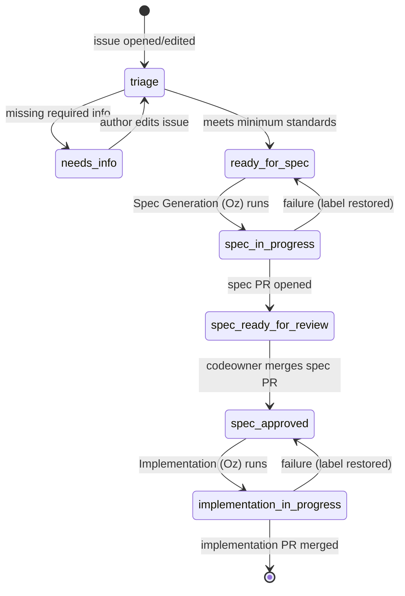

<!-- Improved compatibility of back to top link: See: https://github.com/othneildrew/Best-README-Template/pull/73 -->

<a name="readme-top"></a>

<!--
*** Thanks for checking out the Best-README-Template. If you have a suggestion
*** that would make this better, please fork the repo and create a pull request
*** or simply open an issue with the tag "enhancement".
*** Don't forget to give the project a star!
*** Thanks again! Now go create something AMAZING! :D
-->

<!-- PROJECT SHIELDS -->
<!--
*** I'm using markdown "reference style" links for readability.
*** Reference links are enclosed in brackets [ ] instead of parentheses ( ).
*** See the bottom of this document for the declaration of the reference variables
*** for contributors-url, forks-url, etc. This is an optional, concise syntax you may use.
*** https://www.markdownguide.org/basic-syntax/#reference-style-links
-->

[![Contributors][contributors-shield]][contributors-url]
[![Forks][forks-shield]][forks-url]
[![Stargazers][stars-shield]][stars-url]
[![Issues][issues-shield]][issues-url]
[![MIT License][license-shield]][license-url]
[![LinkedIn][linkedin-shield]][linkedin-url]

<!-- PROJECT LOGO -->
<br />
<div align="center">
  <a href="https://github.com/zachreborn/terraform-modules">
    
  </a>

<h3 align="center">terraform-modules</h3>
  <p align="center">
    Terraform modules to deploy and manage cloud resourcesusing the latest well architected frameworks
    <br />
    <a href="https://github.com/zachreborn/terraform-modules"><strong>Explore the docs »</strong></a>
    <br />
    <br />
    <a href="https://zacharyhill.co/">Zachary Hill</a>
    ·
    <a href="https://github.com/zachreborn/terraform-modules/issues">Report Bug</a>
    ·
    <a href="https://github.com/zachreborn/terraform-modules/issues">Request Feature</a>
  </p>
</div>

<!-- TABLE OF CONTENTS -->
<details>
  <summary>Table of Contents</summary>
  <ol>
    <li>
      <a href="#about-the-project">About The Project</a>
      <ul>
        <li><a href="#built-with">Built With</a></li>
      </ul>
    </li>
    <li>
      <a href="#getting-started">Getting Started</a>
      <ul>
        <li><a href="#prerequisites">Prerequisites</a></li>
        <li><a href="#installation">Installation</a></li>
      </ul>
    </li>
    <li><a href="#usage">Usage</a></li>
    <li><a href="#roadmap">Roadmap</a></li>
    <li><a href="#contributing">Contributing</a></li>
    <li><a href="#license">License</a></li>
    <li><a href="#contact">Contact</a></li>
    <li><a href="#acknowledgments">Acknowledgments</a></li>
  </ol>
</details>

<!-- ABOUT THE PROJECT -->

## About The Project

[![Product Name Screen Shot][product-screenshot]](https://github.com/zachreborn/terraform-modules)

These terraform modules were originally created as part of a six month adoption of 'Infrastructure as Code' at Zachary Hill. They serve as the basis to an iterative approach to managing infrastructure. They've grown and expanded to be the workhorse of our organization that we wish to share and collaborate with the world. We are ever evolving and this code will continues to evolve as features, needs, and best practices do.

<p align="right">(<a href="#readme-top">back to top</a>)</p>

### Built With

- [![Terraform][Terraform.io]][Terraform-url]

<p align="right">(<a href="#readme-top">back to top</a>)</p>

<!-- GETTING STARTED -->

## Getting Started

To get a local copy up and running, simply clone this repo.

### Prerequisites

This is an example of how to list things you need to use the software and how to install them.

- MacOS
  ```sh
  brew install terraform
  ```
- Debian/Ubuntu
  ```sh
  apt install terraform
  ```
- Windows
  ```sh
  choco install -y terraform
  ```

### Installation

1. Clone the repo
   ```sh
   git clone https://github.com/zachreborn/terraform-modules.git
   ```

<p align="right">(<a href="#readme-top">back to top</a>)</p>

<!-- USAGE EXAMPLES -->

## Usage

Navigate to the folder for the provider and subsequent module, service, or infrastructure you're looking to utilize. Within each module a README.md has documented the usage instructions and examples for that module. Included in each README.md is also an output of automated `terraform-docs` which has requirements, inputs, and outputs.

### Examples:

- [CloudTrail](https://github.com/zachreborn/terraform-modules/tree/main/modules/aws/cloudtrail)
- [EC2](https://github.com/zachreborn/terraform-modules/tree/main/modules/aws/ec2_instance)
- [VPC](https://github.com/zachreborn/terraform-modules/tree/main/modules/aws/vpc)

_For more examples, please refer to the [Documentation](https://github.com/zachreborn/terraform-modules)_

<p align="right">(<a href="#readme-top">back to top</a>)</p>

<!-- ROADMAP -->

## Roadmap

See the [open issues](https://github.com/zachreborn/terraform-modules/issues) for a full list of proposed features (and known issues).

<p align="right">(<a href="#readme-top">back to top</a>)</p>

<!-- CONTRIBUTING -->

## Contributing

Contributions are what make the open source community such an amazing place to learn, inspire, and create. Any contributions you make are **greatly appreciated**.

This project uses an **Oz-powered agentic development pipeline** that turns well-formed issues into reviewed specs, and approved specs into implementation PRs. You can contribute either by filing an issue and letting the pipeline drive the work, or by opening a PR yourself. Both paths go through the same CI and codeowner review.

The authoritative reference for repo conventions, the pipeline design, labels, and trust gating is [`AGENTS.md`](./AGENTS.md). The sections below summarize what you need to know to participate.

### Pipeline overview

The diagram below shows the end-to-end flow from issue creation to a merged implementation PR. Each transition is driven by a label that the corresponding workflow either applies or reacts to.



The four Oz workflows that drive these transitions are:

- [`issue-triage.yml`](./.github/workflows/issue-triage.yml) — validates new and edited issues against the minimum standards, then applies `needs-info` or `ready-for-spec`.
- [`spec-generation.yml`](./.github/workflows/spec-generation.yml) — opens a spec PR under `.github/specs/issue-<N>-<slug>.md` based on `_template.md`.
- [`spec-approved.yml`](./.github/workflows/spec-approved.yml) — when a spec PR is merged, flips the originating issue to `spec-approved` and dispatches the next stage.
- [`implementation.yml`](./.github/workflows/implementation.yml) — reads the merged spec from `main` and opens an implementation PR with `Fixes #<N>`.

All three Oz-agent workflows (`issue-triage`, `spec-generation`, `implementation`) gate on the issue author's `author_association` being one of `OWNER`, `MEMBER`, or `COLLABORATOR`. Issues from external contributors are not auto-advanced through the pipeline; a maintainer must shepherd them manually. Apply the `skip-oz` label at any time to opt an issue out of all Oz workflows.

### Filing an issue

Use the issue templates under [`.github/ISSUE_TEMPLATE/`](./.github/ISSUE_TEMPLATE) and include everything the triage agent looks for. Issues that meet the minimum standards are auto-labeled `ready-for-spec` and the pipeline takes over from there.

**Bug** issues must include:

1. Affected module path (e.g. `modules/aws/ec2_instance`).
2. Terraform version and relevant provider versions.
3. Reproduction steps.
4. Expected vs. actual behavior.
5. One of: error message, stack trace, or `plan`/`apply` output.
6. Acceptance criteria for "fixed."

**Feature** issues must include:

1. Target module path (existing or proposed under `modules/<provider>/<name>/`).
2. Motivation / problem being solved.
3. High-level proposed inputs and outputs.
4. Breaking-change assessment (yes/no + scope).
5. Acceptance criteria for "done."

If anything is missing, the triage agent will comment listing the gaps and apply `needs-info`. Edit the issue body and the agent will re-evaluate.

### Reviewing an Oz-generated spec

Spec PRs land under [`.github/specs/`](./.github/specs) and are opened **ready-for-review** (not draft) so CODEOWNERS are auto-assigned. Review them as you would any other PR — focus on the proposed `variables.tf` / `outputs.tf` / `main.tf` shape, the breaking-change assessment, and the acceptance criteria. Merging the spec PR is what triggers the implementation stage; do not merge until the design is what you want built.

### Reviewing an Oz-generated implementation

Implementation PRs are opened from branches named `feat/issue-<N>-<slug>` or `fix/issue-<N>-<slug>`, include `Fixes #<N>` in the body, and run through the standard CI (`build.yml`, `test.yml`, `scan.yml`) like any other PR. The same review and merge rules apply. Squash-and-merge is preferred.

### Contributing a PR directly (no pipeline)

You are always free to skip the pipeline and submit a PR the traditional way. This is the right path for small fixes, dependency bumps, or any change where writing a spec first would be more friction than value.

1. Fork the project.
2. Create your feature branch: `git switch -c feat/short-description` (or `fix/...`).
3. Make your changes following the conventions in [`AGENTS.md`](./AGENTS.md) — the four-file module layout, `terraform fmt -recursive`, the tagging pattern, and tfsec/Checkov suppression style.
4. Validate locally: `terraform -chdir=<module_path> init -backend=false` then `terraform -chdir=<module_path> validate`.
5. Push and open a PR. Fill in every section of [`.github/pull_request_template.md`](./.github/pull_request_template.md). CI will auto-regenerate the `terraform-docs` block and auto-commit it.

<p align="right">(<a href="#readme-top">back to top</a>)</p>

<!-- LICENSE -->

## License

Distributed under the MIT License. See `LICENSE.txt` for more information.

<p align="right">(<a href="#readme-top">back to top</a>)</p>

<!-- CONTACT -->

## Contact

Zachary Hill - [![LinkedIn][linkedin-shield]][linkedin-url] - zhill@zacharyhill.co

Project Link: [https://github.com/zachreborn/terraform-modules](https://github.com/zachreborn/terraform-modules)

<p align="right">(<a href="#readme-top">back to top</a>)</p>

<!-- ACKNOWLEDGMENTS -->

## Acknowledgments

- [Zachary Hill](https://zacharyhill.co)
- [Jake Jones](https://github.com/jakeasarus)

<p align="right">(<a href="#readme-top">back to top</a>)</p>

<!-- MARKDOWN LINKS & IMAGES -->
<!-- https://www.markdownguide.org/basic-syntax/#reference-style-links -->

[contributors-shield]: https://img.shields.io/github/contributors/zachreborn/terraform-modules.svg?style=for-the-badge
[contributors-url]: https://github.com/zachreborn/terraform-modules/graphs/contributors
[forks-shield]: https://img.shields.io/github/forks/zachreborn/terraform-modules.svg?style=for-the-badge
[forks-url]: https://github.com/zachreborn/terraform-modules/network/members
[stars-shield]: https://img.shields.io/github/stars/zachreborn/terraform-modules.svg?style=for-the-badge
[stars-url]: https://github.com/zachreborn/terraform-modules/stargazers
[issues-shield]: https://img.shields.io/github/issues/zachreborn/terraform-modules.svg?style=for-the-badge
[issues-url]: https://github.com/zachreborn/terraform-modules/issues
[license-shield]: https://img.shields.io/github/license/zachreborn/terraform-modules.svg?style=for-the-badge
[license-url]: https://github.com/zachreborn/terraform-modules/blob/master/LICENSE.txt
[linkedin-shield]: https://img.shields.io/badge/-LinkedIn-black.svg?style=for-the-badge&logo=linkedin&colorB=555
[linkedin-url]: https://www.linkedin.com/in/zachary-hill-5524257a/
[product-screenshot]: /images/screenshot.webp
[Next.js]: https://img.shields.io/badge/next.js-000000?style=for-the-badge&logo=nextdotjs&logoColor=white
[Next-url]: https://nextjs.org/
[React.js]: https://img.shields.io/badge/React-20232A?style=for-the-badge&logo=react&logoColor=61DAFB
[React-url]: https://reactjs.org/
[Vue.js]: https://img.shields.io/badge/Vue.js-35495E?style=for-the-badge&logo=vuedotjs&logoColor=4FC08D
[Vue-url]: https://vuejs.org/
[Angular.io]: https://img.shields.io/badge/Angular-DD0031?style=for-the-badge&logo=angular&logoColor=white
[Angular-url]: https://angular.io/
[Svelte.dev]: https://img.shields.io/badge/Svelte-4A4A55?style=for-the-badge&logo=svelte&logoColor=FF3E00
[Svelte-url]: https://svelte.dev/
[Laravel.com]: https://img.shields.io/badge/Laravel-FF2D20?style=for-the-badge&logo=laravel&logoColor=white
[Laravel-url]: https://laravel.com
[Bootstrap.com]: https://img.shields.io/badge/Bootstrap-563D7C?style=for-the-badge&logo=bootstrap&logoColor=white
[Bootstrap-url]: https://getbootstrap.com
[JQuery.com]: https://img.shields.io/badge/jQuery-0769AD?style=for-the-badge&logo=jquery&logoColor=white
[JQuery-url]: https://jquery.com
[Terraform.io]: https://img.shields.io/badge/Terraform-7B42BC?style=for-the-badge&logo=terraform
[Terraform-url]: https://terraform.io
