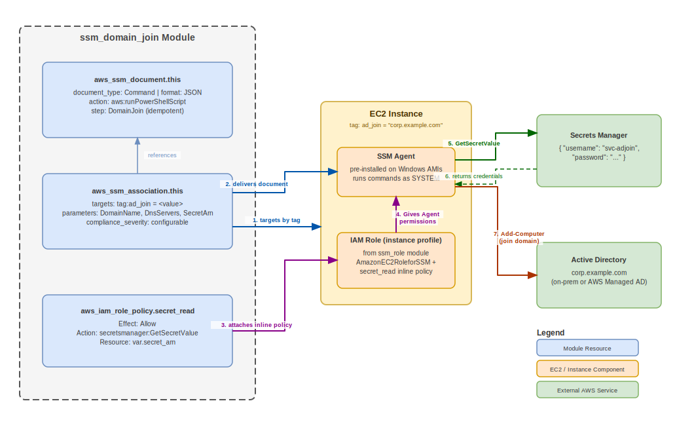

<!-- Improved compatibility of back to top link: See: https://github.com/othneildrew/Best-README-Template/pull/73 -->

<a name="readme-top"></a>

<!-- PROJECT SHIELDS -->
<!--
*** I'm using markdown "reference style" links for readability.
*** Reference links are enclosed in brackets [ ] instead of parentheses ( ).
*** See the bottom of this document for the declaration of the reference variables
*** for contributors-url, forks-url, etc. This is an optional, concise syntax you may use.
*** https://www.markdownguide.org/basic-syntax/#reference-style-links
-->

[![Contributors][contributors-shield]][contributors-url]
[![Forks][forks-shield]][forks-url]
[![Stargazers][stars-shield]][stars-url]
[![Issues][issues-shield]][issues-url]
[![MIT License][license-shield]][license-url]
[![LinkedIn][linkedin-shield]][linkedin-url]

<!-- PROJECT LOGO -->
<br />
<div align="center">
  <a href="https://github.com/zachreborn/terraform-modules">
    
  </a>

<h3 align="center">SSM Domain Join</h3>
  <p align="center">
    Automates Active Directory domain join for Windows EC2 instances using SSM State Manager and Secrets Manager. Any EC2 instance matching the configured targets is automatically renamed to match its EC2 <code>Name</code> tag, optionally set to a specified time zone, and joined to the domain — all in a single reboot, with no user data or baked-in credentials required. If the desired name is already in DNS, the module increments the trailing number (e.g. <code>SERVER01</code> → <code>SERVER02</code>) to avoid collisions.
    <br />
    <a href="https://github.com/zachreborn/terraform-modules"><strong>Explore the docs »</strong></a>
    <br />
    <br />
    <a href="https://zacharyhill.co">Zachary Hill</a>
    ·
    <a href="https://github.com/zachreborn/terraform-modules/issues">Report Bug</a>
    ·
    <a href="https://github.com/zachreborn/terraform-modules/issues">Request Feature</a>
  </p>
</div>

<!-- TABLE OF CONTENTS -->
<details>
  <summary>Table of Contents</summary>
  <ol>
    <li><a href="#usage">Usage</a></li>
    <li><a href="#architecture">Architecture</a></li>
    <li><a href="#cross-account-usage">Cross-Account Usage</a></li>
    <li><a href="#prerequisites">Prerequisites</a></li>
    <li><a href="#notes--design-decisions">Notes / Design Decisions</a></li>
    <li><a href="#requirements">Requirements</a></li>
    <li><a href="#providers">Providers</a></li>
    <li><a href="#modules">Modules</a></li>
    <li><a href="#Resources">Resources</a></li>
    <li><a href="#inputs">Inputs</a></li>
    <li><a href="#outputs">Outputs</a></li>
    <li><a href="#license">License</a></li>
    <li><a href="#contact">Contact</a></li>
    <li><a href="#acknowledgments">Acknowledgments</a></li>
  </ol>
</details>

<!-- USAGE EXAMPLES -->

## Usage

### Simple Example

Tag-targeted domain join using a Secrets Manager secret for credentials.

```hcl
module "ad_join" {
  source = "github.com/zachreborn/terraform-modules//modules/aws/ssm_domain_join?ref=vX.Y.Z"

  domain_name        = "corp.example.com"
  dns_servers        = ["10.0.0.10", "10.0.0.11"]
  secret_arn         = aws_secretsmanager_secret.ad_join.arn
  instance_role_name = module.session_manager.iam_role_name
  timezone           = "Eastern Standard Time"

  targets = [
    {
      key    = "tag:ad_join"
      values = ["corp.example.com"]
    }
  ]

  tags = {
    terraform   = "true"
    environment = "prod"
  }
}
```

Tag any EC2 instance you want auto-joined. The `Name` tag value becomes the computer name:

```hcl
tags = {
  Name    = "WEBSVR01"
  ad_join = "corp.example.com"
}
```

### Scheduled Example

Run the association on a schedule rather than only on instance launch.

```hcl
module "ad_join_scheduled" {
  source = "github.com/zachreborn/terraform-modules//modules/aws/ssm_domain_join?ref=vX.Y.Z"

  domain_name        = "corp.example.com"
  dns_servers        = ["10.0.0.10", "10.0.0.11"]
  secret_arn         = aws_secretsmanager_secret.ad_join.arn
  instance_role_name = module.session_manager.iam_role_name
  timezone           = "Eastern Standard Time"

  schedule_expression         = "rate(1 hour)"
  apply_only_at_cron_interval = false
  compliance_severity         = "HIGH"

  targets = [
    {
      key    = "tag:ad_join"
      values = ["corp.example.com"]
    }
  ]

  tags = {
    terraform   = "true"
    environment = "prod"
  }
}
```

_For more examples, please refer to the [Documentation](https://github.com/zachreborn/terraform-modules)_

<p align="right">(<a href="#readme-top">back to top</a>)</p>

<!-- ARCHITECTURE -->

## Architecture

The diagram below shows the resources this module creates and how they interact with each other and with an example EC2 instance at runtime.



| Step | What happens |
|------|-------------|
| 1 | SSM State Manager targets instances that carry the `ad_join` tag. |
| 2 | The association delivers the `aws_ssm_document` to the SSM Agent and triggers execution. |
| 3 | The inline IAM policy (`aws_iam_role_policy`) is attached to the instance's IAM role, granting `secretsmanager:GetSecretValue`, `kms:Decrypt` (if a KMS key is provided), and `ec2:DescribeTags`. |
| 4 | The script configures DNS server addresses on the instance. |
| 5 | If the instance is already domain-joined, the script exits — no further action is taken. |
| 6 | If `timezone` is set, `Set-TimeZone` applies the specified Windows time zone ID. |
| 7 | The SSM Agent calls `GetSecretValue` to retrieve the domain-join credentials from Secrets Manager. |
| 8 | The agent calls the EC2 metadata service (IMDSv2) to read the instance ID and region, then calls `ec2:DescribeTags` to retrieve the `Name` tag value. |
| 9 | The script checks DNS for the desired computer name. If a record already exists, it increments the trailing number (e.g. `SERVER01` → `SERVER02`) until an available name is found. |
| 10 | The agent runs `Add-Computer`, renaming the instance to the resolved name and joining it to the domain in a single reboot. |

<p align="right">(<a href="#readme-top">back to top</a>)</p>

<!-- CROSS-ACCOUNT USAGE -->

## Cross-Account Usage

A common topology is a central **hub** account that holds the domain-join credentials secret, with EC2 instances running in one or more **spoke** accounts. In that model you deploy this module **in each spoke** — it creates the SSM document, the State Manager association, and the inline policy on the instance role *locally* — while the secret and its KMS key stay in the hub and are read cross-account.

Cross-account access to a Secrets Manager secret encrypted with a customer-managed KMS key requires grants on **both** sides. This module handles only the spoke (identity) side; the hub-side grants are yours to add:

| Side | Grant | Provided by |
|------|-------|-------------|
| **Spoke** (instance role identity) | Inline policy: `secretsmanager:GetSecretValue` on `secret_arn`, `kms:Decrypt` on `kms_key_arn`, `ec2:DescribeTags` | **This module** — automatic when you pass `secret_arn` (and `kms_key_arn`) |
| **Hub** — secret resource policy | Allow the spoke role `secretsmanager:GetSecretValue` | You (hub account) |
| **Hub** — KMS key policy | Allow the spoke role `kms:Decrypt` | You (hub account) |

> [!WARNING]
> **Both hub grants are required.** If you add the secret resource policy but forget the KMS key policy, the spoke role will succeed at `GetSecretValue` and then **fail to decrypt** the secret value — the value is encrypted with the customer-managed key, and an identity-side `kms:Decrypt` grant is not sufficient without a matching key-policy grant. This failure mode is easy to miss because the secret metadata call succeeds.

> [!NOTE]
> **Apply ordering.** KMS key policies validate principals at apply time. Create the spoke instance role **before** applying the hub key-policy grant, or the hub apply fails with `MalformedPolicyDocument`. (Secret resource policies that name a spoke role principal have the same constraint.)

### Example

**Spoke account** — deploy the module pointing at the hub's secret and key ARNs:

```hcl
module "ad_join" {
  source = "github.com/zachreborn/terraform-modules//modules/aws/ssm_domain_join?ref=vX.Y.Z"

  domain_name        = "corp.example.com"
  dns_servers        = ["10.0.0.10", "10.0.0.11"]
  secret_arn         = "arn:aws:secretsmanager:us-west-2:111111111111:secret:ad-join-credentials-AbCdEf"
  kms_key_arn        = "arn:aws:kms:us-west-2:111111111111:key/00000000-0000-0000-0000-000000000000"
  instance_role_name = aws_iam_role.ssm_role.name # e.g. "ssm-role"

  targets = [
    {
      key    = "tag:ad_join"
      values = ["corp.example.com"]
    }
  ]

  tags = {
    terraform   = "true"
    environment = "test"
  }
}
```

**Hub account** — grant the spoke role on **both** the secret resource policy and the KMS key policy:

```hcl
# 1) Secret resource policy
resource "aws_secretsmanager_secret_policy" "ad_join" {
  secret_arn = aws_secretsmanager_secret.ad_join.arn
  policy = jsonencode({
    Version = "2012-10-17"
    Statement = [
      {
        Sid       = "SpokeRead"
        Effect    = "Allow"
        Principal = { AWS = "arn:aws:iam::222222222222:role/ssm-role" }
        Action    = "secretsmanager:GetSecretValue"
        Resource  = "*"
      }
    ]
  })
}

# 2) KMS key policy — the easy-to-miss half
resource "aws_kms_key" "ad_join" {
  policy = jsonencode({
    Version = "2012-10-17"
    Statement = [
      {
        Sid       = "RootAccountAccess"
        Effect    = "Allow"
        Principal = { AWS = "arn:aws:iam::111111111111:root" }
        Action    = "kms:*"
        Resource  = "*"
      },
      {
        Sid       = "SecretsManagerAccess"
        Effect    = "Allow"
        Principal = { Service = "secretsmanager.amazonaws.com" }
        Action    = ["kms:Decrypt", "kms:GenerateDataKey", "kms:DescribeKey"]
        Resource  = "*"
      },
      {
        Sid       = "SpokeDecrypt"
        Effect    = "Allow"
        Principal = { AWS = "arn:aws:iam::222222222222:role/ssm-role" }
        Action    = "kms:Decrypt"
        Resource  = "*"
      }
    ]
  })
}
```

<p align="right">(<a href="#readme-top">back to top</a>)</p>

<!-- PREREQUISITES -->

## Prerequisites

Before using this module, ensure the following are in place:

- **Secrets Manager secret** — `secret_arn` must point to a secret whose value is JSON with `username` and `password` keys, e.g. `{"username":"CORP\\\\svc-domainjoin","password":"..."}`. These are the credentials used to join the domain.
- **EC2 IAM role** — `instance_role_name` must be an existing IAM role attached to the target instances (typically the SSM-managed instance role). This module attaches inline policies to it; it does not create the role.
- **SSM connectivity** — the SSM Agent must be running on the target instances and able to reach SSM/Secrets Manager endpoints (directly or via VPC endpoints).
- **PowerShell modules on the instance** — the in-script tag lookup uses `Get-EC2Tag` (`AWS.Tools.EC2`) and, when `cloudwatch_log_group_name` is set, in-script logging uses `New-CWLLogGroup` / `Write-CWLLogEvent` (`AWS.Tools.CloudWatchLogs`). These are present on current AWS Windows AMIs but are **not** guaranteed on custom or minimal images. If `AWS.Tools.CloudWatchLogs` is absent the domain join still completes — only the in-script CloudWatch writes are skipped (the failure is caught silently); SSM still captures command output. If `AWS.Tools.EC2` is absent the tag lookup fails and the run exits non-zero.
- **Cross-account (hub/spoke) only** — the hub-account Secrets Manager resource policy and the KMS key policy granting the spoke instance role access are **caller-managed**. See [Cross-Account Usage](#cross-account-usage).

<p align="right">(<a href="#readme-top">back to top</a>)</p>

<!-- NOTES / DESIGN DECISIONS -->

## Notes / Design Decisions

- **`compliance_severity` defaults to `MEDIUM`.** A failed domain join leaves an instance unmanaged by Active Directory, which is a real operational problem, so the default produces a visible State Manager compliance signal out of the box rather than the silent `UNSPECIFIED`. Override to `HIGH`/`CRITICAL` for more aggressive alerting, or `LOW`/`UNSPECIFIED` to quiet it.
- **IMDSv2 is used for instance metadata.** The script fetches a token via `PUT /latest/api/token` and passes it on subsequent metadata calls to read the instance ID and region. This works on instances configured for IMDSv2-required and remains compatible with IMDSv1-optional.
- **Computer-name collision handling.** The desired name comes from the EC2 `Name` tag. The script resolves the name in DNS and, if it already exists, increments the trailing number (e.g. `SERVER01` → `SERVER02`), preserving zero-padding width. Windows NetBIOS computer names are limited to 15 characters: a base name longer than 15 characters is truncated, and if no unique name can be formed within the 15-character limit the run exits non-zero rather than joining with a colliding name.
- **CloudWatch logging is optional and delegated.** When `cloudwatch_log_group_name` is set, the log group is created via the `modules/aws/cloudwatch/log_group` child module (not inline) so encryption-at-rest, log class, retention, and skip-destroy are all configurable and consistent with the rest of the library.

<p align="right">(<a href="#readme-top">back to top</a>)</p>

<!-- terraform-docs output will be input automatically below-->
<!-- terraform-docs markdown table --output-file README.md --output-mode inject .-->
<!-- Run the command above to regenerate the Inputs/Outputs tables after any variable changes. -->
<!-- BEGIN_TF_DOCS -->
## Requirements

| Name | Version |
|------|---------|
| <a name="requirement_terraform"></a> [terraform](#requirement\_terraform) | >= 1.0.0 |
| <a name="requirement_aws"></a> [aws](#requirement\_aws) | >= 6.0.0 |

## Providers

| Name | Version |
|------|---------|
| <a name="provider_aws"></a> [aws](#provider\_aws) | >= 6.0.0 |

## Modules

| Name | Source | Version |
|------|--------|---------|
| <a name="module_domain_join_log_group"></a> [domain\_join\_log\_group](#module\_domain\_join\_log\_group) | ../cloudwatch/log_group | n/a |

## Resources

| Name | Type |
|------|------|
| [aws_iam_role_policy.cloudwatch_logs](https://registry.terraform.io/providers/hashicorp/aws/latest/docs/resources/iam_role_policy) | resource |
| [aws_iam_role_policy.secret_read](https://registry.terraform.io/providers/hashicorp/aws/latest/docs/resources/iam_role_policy) | resource |
| [aws_ssm_association.this](https://registry.terraform.io/providers/hashicorp/aws/latest/docs/resources/ssm_association) | resource |
| [aws_ssm_document.this](https://registry.terraform.io/providers/hashicorp/aws/latest/docs/resources/ssm_document) | resource |

## Inputs

| Name | Description | Type | Default | Required |
|------|-------------|------|---------|:--------:|
| <a name="input_apply_only_at_cron_interval"></a> [apply\_only\_at\_cron\_interval](#input\_apply\_only\_at\_cron\_interval) | (Optional) When true, the association runs only at the cron interval specified by schedule\_expression and not on instance start. | `bool` | `false` | no |
| <a name="input_association_name"></a> [association\_name](#input\_association\_name) | (Optional) Descriptive name for the SSM association. If null, AWS assigns a default name. | `string` | `null` | no |
| <a name="input_cloudwatch_log_group_class"></a> [cloudwatch\_log\_group\_class](#input\_cloudwatch\_log\_group\_class) | (Optional) Log class of the CloudWatch Logs log group. Valid values are STANDARD and INFREQUENT\_ACCESS. | `string` | `"STANDARD"` | no |
| <a name="input_cloudwatch_log_group_kms_key_id"></a> [cloudwatch\_log\_group\_kms\_key\_id](#input\_cloudwatch\_log\_group\_kms\_key\_id) | (Optional) ARN of the KMS key used to encrypt the CloudWatch Logs log group at rest. If null, CloudWatch Logs uses the default AWS-managed encryption. | `string` | `null` | no |
| <a name="input_cloudwatch_log_group_name"></a> [cloudwatch\_log\_group\_name](#input\_cloudwatch\_log\_group\_name) | (Optional) Name of the CloudWatch Logs log group for domain join output. If null, CloudWatch logging is disabled. | `string` | `null` | no |
| <a name="input_cloudwatch_log_group_skip_destroy"></a> [cloudwatch\_log\_group\_skip\_destroy](#input\_cloudwatch\_log\_group\_skip\_destroy) | (Optional) When true, the CloudWatch Logs log group is retained on destroy rather than deleted. | `bool` | `false` | no |
| <a name="input_cloudwatch_log_retention_days"></a> [cloudwatch\_log\_retention\_days](#input\_cloudwatch\_log\_retention\_days) | (Optional) Retention period in days for the CloudWatch Logs log group. Must be a valid CloudWatch retention value. | `number` | `30` | no |
| <a name="input_compliance_severity"></a> [compliance\_severity](#input\_compliance\_severity) | (Optional) Compliance severity reported when instances are non-compliant. Valid values are CRITICAL, HIGH, MEDIUM, LOW, UNSPECIFIED. | `string` | `"MEDIUM"` | no |
| <a name="input_dns_servers"></a> [dns\_servers](#input\_dns\_servers) | (Required) DC IPs the joined instance should use for DNS resolution. | `list(string)` | n/a | yes |
| <a name="input_document_version"></a> [document\_version](#input\_document\_version) | (Optional) SSM document version to run. Valid values are $Default, $Latest, or a numeric version string. If null, the default version is used. | `string` | `null` | no |
| <a name="input_domain_name"></a> [domain\_name](#input\_domain\_name) | (Required) FQDN of the domain to join, e.g. corp.example.com. | `string` | n/a | yes |
| <a name="input_instance_role_name"></a> [instance\_role\_name](#input\_instance\_role\_name) | (Required) Name of the EC2 IAM role to grant secretsmanager:GetSecretValue on secret\_arn and ec2:DescribeTags. | `string` | n/a | yes |
| <a name="input_kms_key_arn"></a> [kms\_key\_arn](#input\_kms\_key\_arn) | (Optional) ARN of the KMS key used to encrypt the Secrets Manager secret. When set, grants kms:Decrypt on that key to the instance role. Required if the secret uses a customer-managed KMS key. | `string` | `null` | no |
| <a name="input_max_concurrency"></a> [max\_concurrency](#input\_max\_concurrency) | (Optional) Maximum number or percentage of targets to run the association on simultaneously, e.g. 10 or 10%. If null, no concurrency limit is applied. | `string` | `null` | no |
| <a name="input_max_errors"></a> [max\_errors](#input\_max\_errors) | (Optional) Maximum number or percentage of errors allowed before the association stops, e.g. 10 or 10%. If null, no error limit is applied. | `string` | `null` | no |
| <a name="input_name"></a> [name](#input\_name) | (Optional) Name of the SSM document and base name for the IAM inline policies. Conflicts with name\_prefix; set one or the other, not both. If null, defaults to ssm-domain-join. | `string` | `null` | no |
| <a name="input_name_prefix"></a> [name\_prefix](#input\_name\_prefix) | (Optional) Creates a unique name for the IAM inline policies using this prefix instead of name. Conflicts with name; set one or the other, not both. If null, name is used. | `string` | `null` | no |
| <a name="input_ou_path"></a> [ou\_path](#input\_ou\_path) | (Optional) Distinguished name of the OU to place the joined computer object in, e.g. OU=Servers,DC=corp,DC=example,DC=com. If null, the computer is placed in the default Computers container. | `string` | `null` | no |
| <a name="input_output_location_s3_bucket_name"></a> [output\_location\_s3\_bucket\_name](#input\_output\_location\_s3\_bucket\_name) | (Optional) Name of the S3 bucket to store SSM association output. If null, output is not saved to S3. | `string` | `null` | no |
| <a name="input_output_location_s3_key_prefix"></a> [output\_location\_s3\_key\_prefix](#input\_output\_location\_s3\_key\_prefix) | (Optional) S3 key prefix for SSM association output. If null, no key prefix is applied. | `string` | `null` | no |
| <a name="input_output_location_s3_region"></a> [output\_location\_s3\_region](#input\_output\_location\_s3\_region) | (Optional) AWS region of the S3 bucket for SSM association output. If null, the region of the association is used. | `string` | `null` | no |
| <a name="input_permissions"></a> [permissions](#input\_permissions) | (Optional) Additional sharing permissions for the SSM document. If null, no sharing permissions are applied. type must be Share. | <pre>object({<br/>    account_ids = string<br/>    type        = string<br/>  })</pre> | `null` | no |
| <a name="input_schedule_expression"></a> [schedule\_expression](#input\_schedule\_expression) | (Optional) Cron or rate expression controlling how often the association runs, e.g. rate(30 minutes) or cron(0 2 * * ? *). If null, the association runs once on instance launch. | `string` | `null` | no |
| <a name="input_secret_arn"></a> [secret\_arn](#input\_secret\_arn) | (Required) ARN of the Secrets Manager secret holding join credentials. Secret must be JSON-shaped with username and password keys. Cross-account ARNs are supported. | `string` | n/a | yes |
| <a name="input_sync_compliance"></a> [sync\_compliance](#input\_sync\_compliance) | (Optional) Compliance reporting mode for the association. Valid values are AUTO and MANUAL. | `string` | `"AUTO"` | no |
| <a name="input_tags"></a> [tags](#input\_tags) | (Optional) Map of tags to assign to the resources. | `map(string)` | `{}` | no |
| <a name="input_target_type"></a> [target\_type](#input\_target\_type) | (Optional) Resource type that the SSM document can target, e.g. /AWS::EC2::Instance. If null, no target type restriction is applied. | `string` | `null` | no |
| <a name="input_targets"></a> [targets](#input\_targets) | (Required) List of target blocks specifying which EC2 instances receive the association. Each target requires a key (e.g. tag:ad\_join) and a list of matching values. | <pre>list(object({<br/>    key    = string<br/>    values = list(string)<br/>  }))</pre> | n/a | yes |
| <a name="input_timezone"></a> [timezone](#input\_timezone) | (Optional) Windows time zone ID to apply before joining the domain, e.g. 'Mountain Standard Time'. Full list of valid IDs: https://learn.microsoft.com/en-us/windows-hardware/manufacture/desktop/default-time-zones. Despite the 'Standard' suffix on most IDs, DST is observed automatically. If null, the time zone is not changed. | `string` | `null` | no |
| <a name="input_version_name"></a> [version\_name](#input\_version\_name) | (Optional) Human-readable version name for the SSM document. If null, no version name is assigned. | `string` | `null` | no |
| <a name="input_wait_for_success_timeout_seconds"></a> [wait\_for\_success\_timeout\_seconds](#input\_wait\_for\_success\_timeout\_seconds) | (Optional) Number of seconds to wait for the association to reach a success status. If null, Terraform does not wait for the association to succeed. | `number` | `null` | no |

## Outputs

| Name | Description |
|------|-------------|
| <a name="output_cloudwatch_log_group_arn"></a> [cloudwatch\_log\_group\_arn](#output\_cloudwatch\_log\_group\_arn) | ARN of the CloudWatch Logs log group, or null if CloudWatch logging is disabled. |
| <a name="output_cloudwatch_log_group_name"></a> [cloudwatch\_log\_group\_name](#output\_cloudwatch\_log\_group\_name) | Name of the CloudWatch Logs log group, or null if CloudWatch logging is disabled. |
| <a name="output_iam_cloudwatch_logs_policy_name"></a> [iam\_cloudwatch\_logs\_policy\_name](#output\_iam\_cloudwatch\_logs\_policy\_name) | Name of the inline IAM policy granting CloudWatch Logs write access, or null when CloudWatch logging is disabled. |
| <a name="output_iam_secret_read_policy_name"></a> [iam\_secret\_read\_policy\_name](#output\_iam\_secret\_read\_policy\_name) | Name of the inline IAM policy granting Secrets Manager / KMS / EC2 tag read access. |
| <a name="output_ssm_association_arn"></a> [ssm\_association\_arn](#output\_ssm\_association\_arn) | ARN of the SSM State Manager association. |
| <a name="output_ssm_association_id"></a> [ssm\_association\_id](#output\_ssm\_association\_id) | ID of the SSM State Manager association. |
| <a name="output_ssm_document_arn"></a> [ssm\_document\_arn](#output\_ssm\_document\_arn) | ARN of the SSM domain join document. |
| <a name="output_ssm_document_name"></a> [ssm\_document\_name](#output\_ssm\_document\_name) | Name of the SSM domain join document. |
<!-- END_TF_DOCS -->

<!-- LICENSE -->

## License

Distributed under the MIT License. See `LICENSE.txt` for more information.

<p align="right">(<a href="#readme-top">back to top</a>)</p>

<!-- CONTACT -->

## Contact

Zachary Hill - [![LinkedIn][linkedin-shield]][linkedin-url] - zhill@zacharyhill.co

Project Link: [https://github.com/zachreborn/terraform-modules](https://github.com/zachreborn/terraform-modules)

<p align="right">(<a href="#readme-top">back to top</a>)</p>

<!-- ACKNOWLEDGMENTS -->

## Acknowledgments

- [Zachary Hill](https://zacharyhill.co)
- [Jake Jones](https://github.com/jakeasarus)
- [Brad Engberg](https://github.com/bradms98)

<p align="right">(<a href="#readme-top">back to top</a>)</p>

<!-- MARKDOWN LINKS & IMAGES -->
<!-- https://www.markdownguide.org/basic-syntax/#reference-style-links -->

[contributors-shield]: https://img.shields.io/github/contributors/zachreborn/terraform-modules.svg?style=for-the-badge
[contributors-url]: https://github.com/zachreborn/terraform-modules/graphs/contributors
[forks-shield]: https://img.shields.io/github/forks/zachreborn/terraform-modules.svg?style=for-the-badge
[forks-url]: https://github.com/zachreborn/terraform-modules/network/members
[stars-shield]: https://img.shields.io/github/stars/zachreborn/terraform-modules.svg?style=for-the-badge
[stars-url]: https://github.com/zachreborn/terraform-modules/stargazers
[issues-shield]: https://img.shields.io/github/issues/zachreborn/terraform-modules.svg?style=for-the-badge
[issues-url]: https://github.com/zachreborn/terraform-modules/issues
[license-shield]: https://img.shields.io/github/license/zachreborn/terraform-modules.svg?style=for-the-badge
[license-url]: https://github.com/zachreborn/terraform-modules/blob/master/LICENSE.txt
[linkedin-shield]: https://img.shields.io/badge/-LinkedIn-black.svg?style=for-the-badge&logo=linkedin&colorB=555
[linkedin-url]: https://www.linkedin.com/in/zachary-hill-5524257a/
[product-screenshot]: /images/screenshot.webp
[Terraform.io]: https://img.shields.io/badge/Terraform-7B42BC?style=for-the-badge&logo=terraform
[Terraform-url]: https://terraform.io
